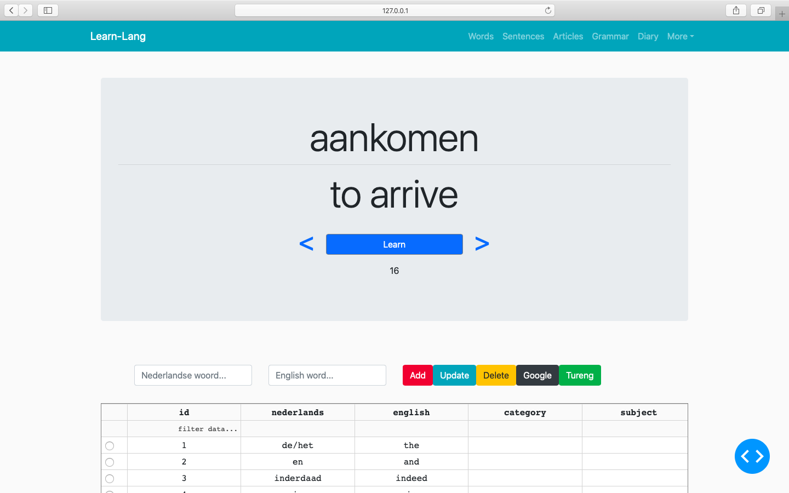
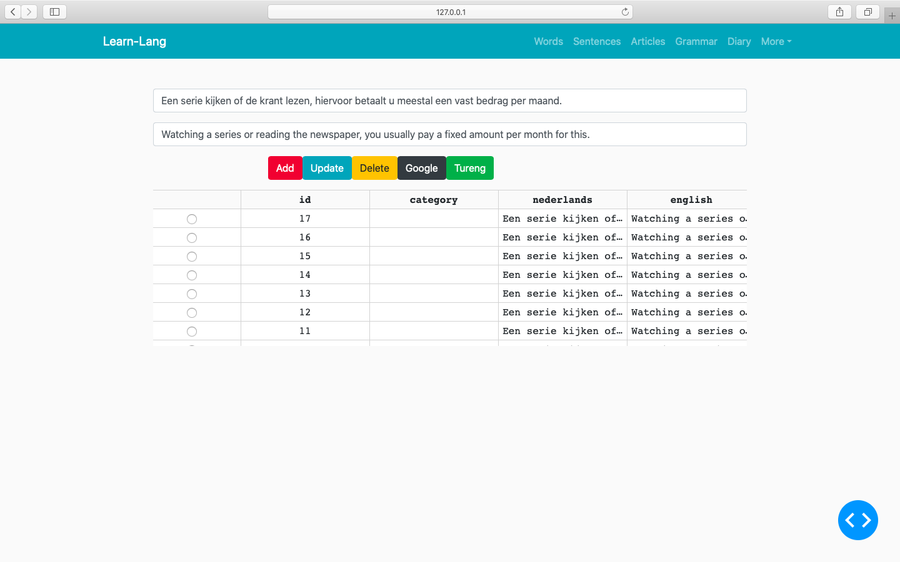
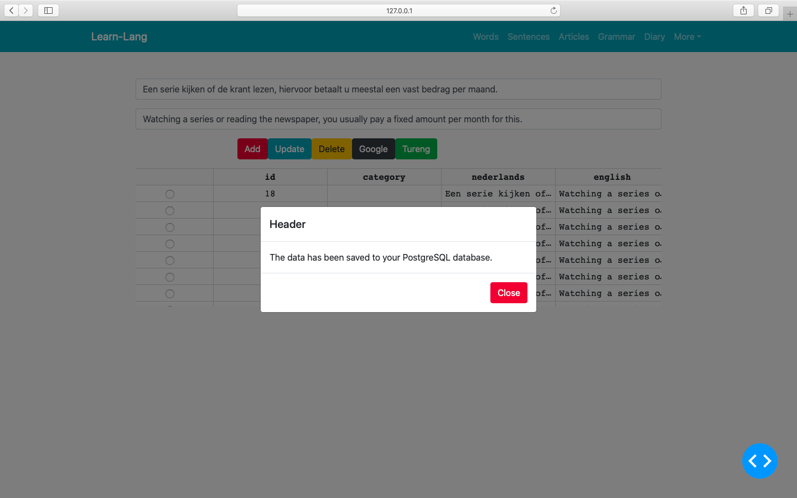
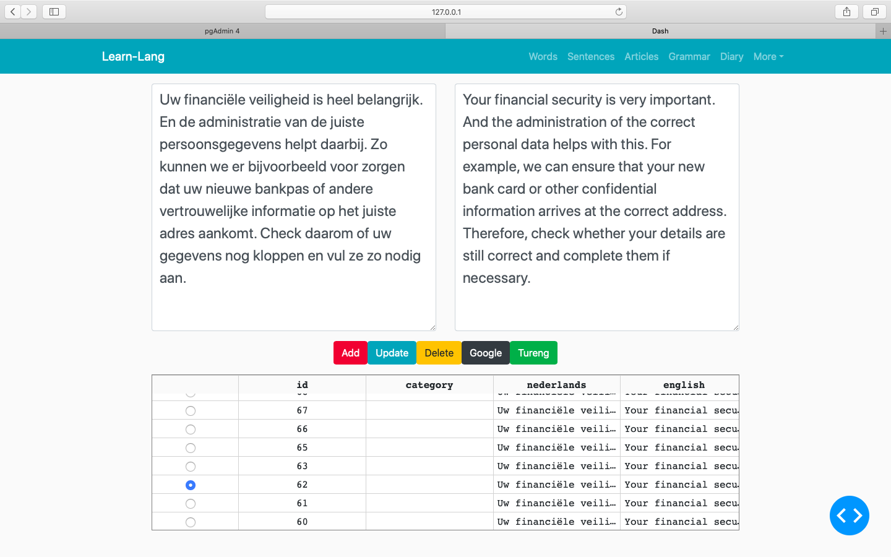

# This file contains the codes of a platform aiming teaching languages. You will start learning a language by words, sentences and articles in sequence. At the sametime you will learn the basic grammer rules as well. Our aim is to able to speak within 6 months while spending minimum time for grammer.

### Words page

### Sentences page

### Articles page

